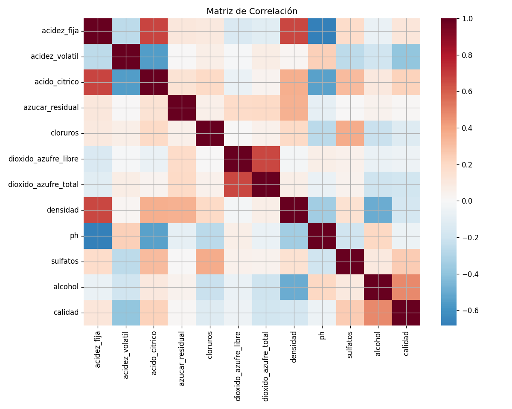
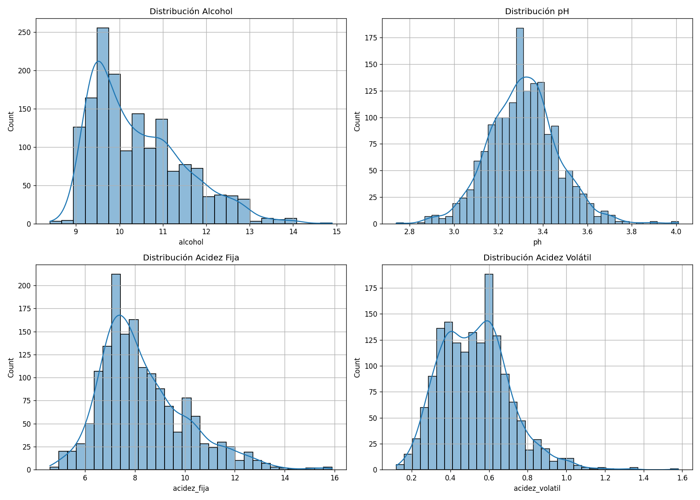
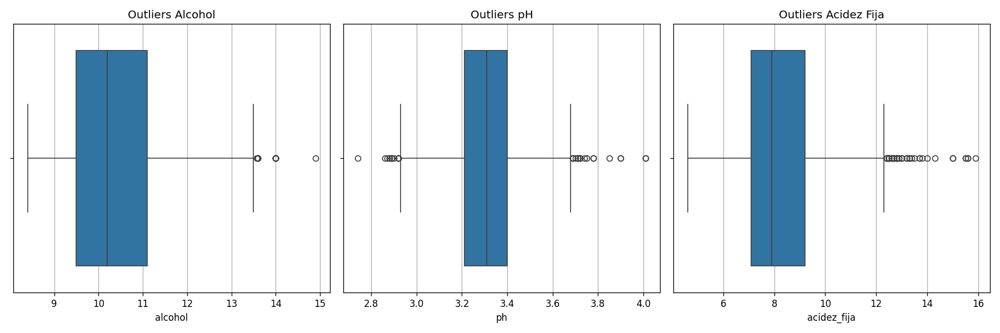

# 🍷 Sistema Integrado de Análisis Enológico (Calidad del Vino)
### Curso Python para APIs e IA Aplicada — Universidad Santo Tomás (USTA)


---

## ¿Qué hace este proyecto?

Transforma un dataset crudo sobre la calidad del vino tinto (`winequality-red.csv`) en un **pipeline reproducible de análisis**, aplicando todos los conceptos de las Semanas 1, 2 y 3 del curso.

El eje temático principal es entender qué características químicas (como el pH, los niveles de alcohol y la acidez) influyen en la puntuación o clasificación de **Calidad del Vino**. El proyecto ingesta los datos, los valida rigurosamente, genera reportes exploratorios (EDA), limpia los datos basándose en evidencias estadísticas, y finalmente expone este motor a través de una API RESTful con Flask.

---

## 🗂 Estructura del Proyecto

```text
/
│
├── analisis_calidad_del_vino.py  ← Pipeline principal (integra todos los módulos)
├── app.py                        ← Servidor Flask con endpoints web estables (Semana 3)
├── decorators.py                 ← Librería de decoradores de logging y estadística (Semana 1)
├── schemas.py                    ← Modelos Pydantic de validación estricta (Semana 2)
├── requirements.txt
│
├── data/                         ← Datasets de origen y destino
│   ├── dataset_calidad_vinos.csv
│   ├── vinos_limpio.csv
│   └── csv_limpio_desde_api.csv
│
└── outputs/                      ← Artefactos y gráficas generadas (Reporte EDA e IA)
    ├── reporte_ia.json
    ├── reporte_eda.json
    ├── eda_01_distribuciones.png
    ├── eda_02_outliers.png
    ├── eda_03_correlaciones.png
    └── eda_04_relaciones_calidad.png
```

---

## 🚀 Instalación y Ejecución

```bash
# 1. Clona el repositorio
git clone <tu-repositorio-url>
cd Python_para_APIs

# 2. Crea un entorno virtual para reproducibilidad
python -m venv venv

# Windows:
venv\Scripts\activate
# Mac/Linux:
source venv/bin/activate

# 3. Instala las dependencias
pip install -r requirements.txt

# 4. OPCIÓN A: Ejecutar el pipeline completo de análisis localmente (genera gráficas en outputs/)
python analisis_calidad_del_vino.py

# 5. OPCIÓN B: Levantar el servidor web de la API
python app.py
```

---

## 🧠 Conceptos Aplicados — Semana 1

### 1. Pattern Matching (`match/case`)

**Qué es:** Estructura de control introducida en Python 3.10 para evaluar valores contra patrones y condiciones escalables.
**Aplicación:** Clasifica las muestras de vino en categorías legibles basándose en la variable de calidad.

```python
def clasificar_vino(data: dict) -> str:
    match data:
        # Se extrae dict condicional con guardas lógicas
        case {"calidad": c} if c >= 8:
            return "premium"
        case {"calidad": c} if c >= 6:
            return "estandar"
        case {"calidad": c} if c >= 4:
            return "economico"
        case _:
            return "baja_calidad"
```

### 2. Decoradores Personalizados e introspección (`@functools.wraps`)

**Qué son:** Funciones "envoltorio" que amplían la funcionalidad sin alterar el código original (Principio Open/Closed).

**a) Decorador simple (`@registrar_ejecucion`):** Mide el tiempo exacto que tarda en correr cada etapa del pipeline.
**b) Decorator factory (`@validar_normalidad`):** Una función avanzada que retorna un decorador parametrizable (`alpha=0.05`). Aplica el test estadístico de *Shapiro-Wilk* al `pH` de forma silenciosa para recomendar qué tipo de métricas usar en el análisis.

### 3. Modularización Completa de Funciones Puras
El código no es un monolito espagueti, está dividido lógicamente:
- `analisis_calidad_del_vino.py` (Orquestador principal)
- `decorators.py` (Lógica estadística y logging)
- `schemas.py` (Contratos de datos de entrada)

---

## 🧠 Conceptos Aplicados — Semana 2

### 4. Pydantic v2 — Contratos Estrictos de Datos

**Por qué no usar simple tipado:** Las anotaciones primitivas no detectan valores "absurdos" (Ej: Un pH de nivel de pila alcalina). Pydantic interviene *antes* de que los datos sucios entren al sistema.

```python
class VinoSchema(BaseModel):
    ph: float      = Field(ge=2.5, le=4.5)     # ⬅ Limita rango lógico biológico
    alcohol: float = Field(ge=7.0, le=20.0)    # ⬅ Evita graduaciones atípicas
    calidad: int   = Field(ge=0, le=10)        # ⬅ Solo puntajes del 0 al 10
    
    model_config = ConfigDict(str_strip_whitespace=True)
```
Si un registro del CSV crudo rompe este contrato estructurado (`VinoSchema`), es capturado e ignorado silenciosamente durante la fase de **Ingesta**, salvaguardando la solidez matemática del EDA posterior.

### 5. OOP — Pipelines Fluidos (Fluent Interface)

Las funciones de limpieza y exploración están atadas a la clase `PipelineVinos`. Esto nos permite mantener el estado lógico (`self.df`) limpio y encadenar múltiples llamados (Fluent Interface) de manera muy elegante en el método principal:

```python
pipeline = PipelineVinos("data/winequality-red.csv")

(pipeline
    .ingestar()            # Valida contra Pydantic
    .eda()                 # Gráficas, y JSONs
    .limpiar_y_clasificar()# Drop duplicates y Pattern Matching
    .interpretar_con_ia()  # Generador JSON Diagnóstico
)
```

---

## 🧠 Conceptos Aplicados — Semana 3

### 6. Exposición de micro-servicios vía API Web (`Flask`)

Para salir de la consola local, el modelo se integra en un servidor HTTP ligero preparado para arquitecturas síncronas usando `Flask`.

- **`GET /analizar`**: Despierta el pipeline instanciado y retorna al instante los hallazgos finales (`reporte_ia.json`).
- **`POST /clean`**: Recibe un archivo "sucio" externo enviado por un usuario, le aplica la limpieza matricial base (elimina duplicados/nulos aislados en memoria) y devuelve indicadores numéricos sin sobrescribir los datos principales del backend usando el sistema de Path (`pathlib`).

---

## 📊 Sobre el Dataset / Variables
Extraído originalmente del dominio público (Wine Quality Dataset - Vino Verde, Portugal). Consta de métricas químicas:
- **Ácidos y pH:** `acidez_fija`, `acidez_volatil`, `acido_citrico`, `ph`
- **Trazas y químicos:** `azucar_residual`, `cloruros`, `sulfatos`, `alcohol`
- **Output Auditado de Expertos:** `calidad` (Variable a medir/predecir).

## 📈 Hallazgos del Exploratory Data Analysis (EDA)

El pipeline explora y exporta visualmente el estado del dataset. A continuación, algunos de los hallazgos gráficos más importantes documentados en el proceso:

### 1. Correlaciones Químicas y de Calidad


> **Hallazgo:** Existe una correlación positiva (`r=0.476`) entre el nivel de **Alcohol** y la **Calidad** dictaminada por los expertos. Por el contrario, una alta **Acidez Volátil** (relacionada al sabor a vinagre) merma fuertemente el puntaje de calidad del vino (`r=-0.390`).

### 2. Estabilidad de la Muestra (Distribuciones)


> **Hallazgo:** El pH (abajo izquierda) demuestra un comportamiento notablemente normal y estable (Media `3.31`), garantizando una acidez apta para consumo sin valores atípicos absurdos. Por otro lado, la densidad y la acidez fija están muy relacionadas entre sí (`r=0.66`).
 
### 3. Tratamiento de Valores Atípicos


> **Decisión de Limpieza:** Como se evidencia gráficamente en los *Boxplots* (Cajas y Bigotes), la variable *alcohol* poseía algunos picos aislados extremos. Se optó por podar todo valor por encima del **percentil 98 (P98)**, estabilizando la muestra antes de entregarla al diagnóstico de Inteligencia Artificial (Reporte IA). Adicionalmente, se suprimieron **240 duplicados** que sobre-representaban los resultados.

Para detallar más los hallazgos estadísticos, revisar las 4 infografías autogeneradas y los `.json` crudos en la carpeta `outputs/`.

---

## 👩‍💻 Autores
**Vanessa Cortes**
*Python para APIs e IA Aplicada — Universidad Santo Tomás · 2026*

## 📜 Licencia
MIT